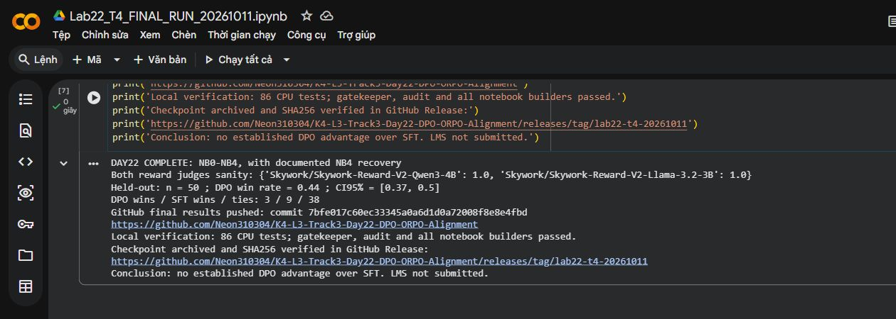

# Kiểm tra lượt T4 ngày 2026-10-11

NB0–NB3 hoàn tất từ checkout source-only, commit `53a00376e779fbf06471dfeb42032027bfd56653`. NB4 sinh đủ 58 answers rồi lỗi CUDA trong kernel Unsloth. Lịch sử thất bại giữ `make pipeline` exit 2 và log gốc. NB4 phục hồi bằng `make eval`, không train lại hay sinh lại answers, dùng source overlay `033bf86c680a8104d5cc1d52df811b204c445c11`. Manifest cuối có đủ năm stage thành công, entrypoint ghi rõ cả hai lượt.

SHA answers: `f37541d4f21577008cd6183e6a788522bfd95726de50d43d92b0d65a946fc78e`. Cả hai judge sanity 12/12; 232 score hữu hạn. Held-out: 3 DPO / 9 SFT / 38 hòa, win rate 44.00%, CI [37.00%; 50.00%]. Chưa đủ bằng chứng DPO tốt hơn SFT. 38/58 cặp giống hệt; thẻ công cụ SFT/DPO 58/58 trên 58.

SFT 1.000 mẫu/125 bước; DPO 800/100 split/100 bước; seed 42, β=0,1, LR 5e-6, max length 768. Reward held-out đánh giá tại 25/50/75/100. Reference config thật và SHA merged weights được xuất; weights không nằm trong bài nộp.

Bản sao riêng LoRA đã tải về và kiểm CRC, 46 file và mọi checksum khớp; receipt chỉ chứa metadata, weights ở `.cache/private-training-backup-20261011/`. Nó không chứa weights merged và không tự là bài nộp hoàn chỉnh.

Kiểm cuối: `tests-current-code.json`, `final-checks.json`, `audit.json`, `final-export-validation.json`, `publishable-scan.json`, `submission-status.json`. Không dùng file lịch sử để chứng nhận lượt mới. Bonus chưa chạy; LMS chưa nộp.

Theo yêu cầu lưu trước khi dọn máy, checkpoint và các artifact lịch sử đã được upload lên GitHub Release, kiểm SHA256 trên server. Xem [ARCHIVE.md](ARCHIVE.md); đường dẫn `.cache` trong receipt gốc là vị trí trước khi dọn.

